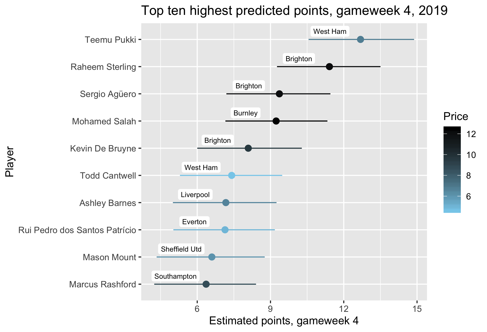

---
output:
  bookdown::html_document2: 
    toc: true
    toc_float: true
layout: post
title: Captaincy choice, FPL gameweek 4 2019
categories: blog
date: August 2019
---

 

# Captaincy choice, FPL gameweek 4 2019 {-#captain4}

 

## Picking an FPL captain: Gameweek 4 {-#picking}

Making a good captaincy choice can have a considerable impact on your weekly points total in Fantasy Football. In gameweek 3, Mo Salah (c) would've raked you in 30 points, whereas the more popular choice of Raheem Sterling (c) got me and many others a nonetheless healthy 16.   

The problem with this example is of course that *it made more sense to pick Sterling*. No-one should regret going Sterling (c) over Salah (c). There are two simple reasons for this:

1. Sterling was the **more popular** pick   
2. Sterling had a higher **expected points** value

Hindsight is everything in the way we assess these decisions, but really we should remember these two key points, because you can't base a decision on hindsight.   

This captaincy pick series represents me moving away from entirely depending on point 1 in my captaincy choices, towards depending entirely on point 2. Usually, I think players tend to take some intuitive weighted average across the two, having a vague idea who most people will pick and who will get the most points. Aubameyang is playing Brighton at home? Probably a popular, high-scoring option. Literally anyone against Liverpool or City? Probably not going to do that well, and no-one is going to pick them. I, however, strictly followed the [/r/FantasyPL subreddit's weekly captaincy poll](https://www.reddit.com/r/FantasyPL/comments/ctuesf/game_week_3_captain_poll/) all of last season. For the most part, this served me well. The results of the poll are a good proxy for which players are being given the armband by the majority of middling-to-good FPL contestants. Following this poll so far this season would've given you 46 points from your captains. Pretty good. This makes sense, because good players make sensible captain choices.    

The reason I depend on the poll so heavily, though, is that following it minimises the extent to which my points differ from those of good players. You can't go far wrong by following the poll results and making sensible transfers elsewhere in your team.    
 
I don't really like doing this, though. One reason is that there often develops a bit of a 'hivemind' mentality whereby the subreddit arrives at a consensus about which players to pick, without this necessarily being the best option. More importantly, though, you're essentially relying on an (admittedly usually pretty reliable) aggregation of heuristics. While some attentive players like to get into the nitty-gritty of XG and players' history against certain teams, usually I think most players just loosely average over the following considerations:

1. Class: which of my players is the best?
2. Form: which of my players is on the best form?
3. Fixture: which of my players is playing the worst team?
4. Venue: which of my players are playing at home?
5. Game time: which of my players will get 90 minutes?  

Often, this kind of thinking gives fairly clear answers. Right now it would be hard to look past Salah at home to anyone in the bottom half of the table, for example. The problem comes when it's not that clear-cut. Kane at home against Watford? Or Sterling away against Brighton? Or Aubameyang at home against Southampton? The popular mantra of 'form over fixtures' can help with this, but usually your captain considerations are players who don't tend to have severe dips in form. They are dependable choices *because* they are consistent.  

## The model {-#model}

In these sorts of situations, it can be hard to pick your captain. So I have coded a Bayesian multilevel model that estimates each player's gameweek points based on their (time-weighted)[^1] previous performance, their opponent, home/away, and how many minutes they get. The multilevel component allows for varying intercepts by team, factoring in the points variance at team level. This helps distinguish between players who do well only because their team does well and those who do well regardless. The model is written in `R`, using [`brms`](https://github.com/paul-buerkner/brms). It's really simple, and I just see it as a way to formalise the thought process in 1-5 above. When you're making the sorts of tough decisions above, you can depend on a more meaningful and formal, probabilistic points prediction which factors in the considerations you would usually mull over heuristically.

[^1]: I won't implement the weightings until ~gameweek 8. I just don't think they're helpful yet.

I get the data for this from [`vaastav`'s amazing GitHub repo](https://github.com/vaastav/Fantasy-Premier-League), and using datapasta to copy the raw-format data into a dataframe in `R`, and then engaging in a lot of tidy wrangling to get simple data on each players points, opponent, team, home/away, and minutes for each gameweek. The model is originally fit with a weakly informative,  fairly wide prior. I then update the model after each gameweek, and get fitted predictions for the following gameweek. The [code is on my github](https://github.com/mbarnfield/fpl), but I'm yet to completely tidy it up and make it fully replicable (i.e., you still have to fudge some stuff manually).   

## Top ten {-#ten4}

Here I show the ten players with the highest expected points total for gameweek four. I will do this each gameweek. However, it's pretty simple also to pass a dataframe of your own team to fit predictions to, and then choose between your own players. You should really have one or more of these top ten in your team, though.  

 

 
 

The colour of each player's point-range marker (which signifies the 95% confidence interval on the estimate) is coloured according to their price: more expensive players are darker. Opponents are labeled. Essentially, the model recommends you captain Teemu Pukki against West Ham. This is unsurprising because he is currently the highest-scoring player. You would expect this to change over the season, as the class of the more expensive players begins to tell. Unsurprisingly, the following four players are all priced at over 9.5 and all from Man City and Liverpool. It's also relevant that the Man City players are up against Brighton, who don't represent much of a challenge. Likewise, Salah seems to have been penalised by having Burnley, who have done well so far, as his opponent.   

You should really have one of those top five in your team, and be choosing between them for the captaincy this week. Choosing one of the remaining five options would be somewhat questionable, although it is interesting to see who is currently outplaying more premium options.

Remember also that these estimates are quite volatile at this point. `brms` flags up several warnings when returning the results because the sample size is currently so low. By the end of the season, barring consistently freakishly good returns for the likes of Sterling, Pukki, Aguero and Salah, there is next to no chance the model will predict anyone scores over 10 points in a given week. There will simply be too many weeks in which these players are in the 2-6 range.    

All the model is doing, really, is describing in a principled way the sorts of things you are probably thinking already. Pukki is on flames, Sterling is an amazing asset, Salah is being Salah, Aguero is being Aguero. But this principled assessment is better than a biased heuristic one.    

I don't have Pukki, so I will be captaining Sterling. On balance, he is probably the better option anyway, because his captain percentage is likely to be higher than Pukki's. 

## Top 25 {-#tfive4}

If for some reason you don't want to, or can't, captain any of these ten, I plot the top 25 below. Of course, you might also just want to see who's there or thereabouts.   

 

 
 

Again, you would expect the composition of this top 25 to change a bit over time, with players like Lundstram (likely still to be a good value pick, but not a good captain choice) gradually replaced by the likes of Kane, Lacazette, Pépé, etc. The estimates will also become more interesting when I introduce weights to make more recent gameweeks count more in players' estimates, bringing in a 'form-factor'. At this point, form is kind of captured regardless because players haven't really had time to peak and trough.    

What this plot makes more clear is the logic of what I'm trying to do. You might be weighing up, for example, Martial (c) vs Southampton against Salah (c) vs Burnley. You're thinking that Burnley away is tough, whereas Martial could do well against The Saints. At this point (with the caveats I keep mentioning), the model is thinks you should go for Salah, but it's really not certain. It has attempted to account for the considerations you would be making here, with very limited data. But, of course, you have more data than the model. You've watched Salah and Martial over a few seasons. You might have an idea about how Burnley will adapt to play against Liverpool, how Martial might exploit some Southampton weakness you spotted watching MOTD. But if it's a toss-up, I think this approach gives you a principled basis on which to choose one over the other.

 
 

Matthew Barnfield, @m_barnfield
