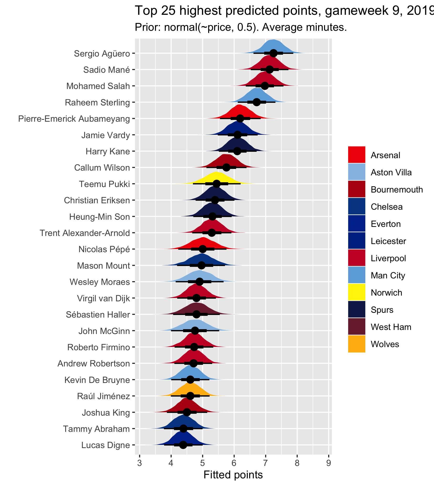

---
output:
  bookdown::html_document2: 
    toc: true
    toc_float: true
layout: post
title: Captaincy choice, FPL gameweek 9 2019
categories: blog
date: October 2019
---

## Picking an FPL captain: Gameweek 9 {-} 

With the international break over, it's time to pick an FPL captain for gameweek 9. I have been running a Bayesian 'captain selection model' every week that attempts to model a captain picking logic to rank players by how good a captain they are for the upcoming gameweek. It is a multilevel model, factoring in that players are clustered within teams. I run it in [`brms`](https://cran.r-project.org/web/packages/brms/brms.pdf), in `R`, using data from gameweek 25 last week up to the most recent gameweek. I get these data from [vastaav](https://github.com/vaastav/Fantasy-Premier-League). The basic syntax of the model looks like this:    

`points | weights(weight) ~ player + opponent + home + minutes + (1 | mm(team_1, team_2))`  

`points` is simply the amount of points a player gets each week, `player` is a vector of player names, `opponent` is a player's opponent each week, `minutes` is how many minutes a player plays each week, and the `(1 | mm(team_1, team_2))` part is the multilevel component, factoring in that some players have played for more than one team over the course of the data. `weights(weight)` assigns more weight to more recent gameweeks, essentially making it so that the most recent gameweek (8) is treated as happening 1.5 times, whereas the first gameweek in the data (gameweek 25 last season) is treated as only having happened once. This weight increases exponentially by week, with a big leap occurring between the two seasons, so that gameweek 1 this season is weighted much closer to gameweek 8 this season than it is to gameweek 38 last season.    

The model is based around predicting points, because it is the player with the highest points that is the best captain choice. However, I don't claim to be building a model that optimally or accurately predicts points. The players are ranked by predicted points, but the specific points values themselves aren't particularly meaningful. It is about how well the players should be expected to do, relative to each other, before we see this week's data. What I'm seeking to do is represent a thought process I think most players go through when picking a captain, <a href="2019-08-27-fpl-4.html">which I spoke about in my first post</a>. Basically, I think we use the following heuristics:

1. Class: which of my players is the best?
2. Form: which of my players is on the best form?
3. Fixture: which of my players is playing the worst team?
4. Venue: which of my players are playing at home?
5. Game time: which of my players will get 90 minutes? 

Sometimes, this thought process doesn't leave us with a clear captain pick. I designed this model because, using the data directly, it can work out how we would expect each player to do, given who they are, who they play for, who they're up against, where they're playing, and how many minutes they'll get. So when this thought process doesn't give us a clear answer, because for instance we might have a week where Agüero is at home against Watford and Salah is at home against Norwich, the model can give us a more objective idea of the probable performance of each player. The fixture, venue and game time are accounted for by `opponent`, `home` and `minutes`. Form is built into the model through the weights, which mean that the model assigns more weight to players' performance in more recent gameweeks. These things, and class, are relevant both at the player level and at the team level --- we want to pick good *players* who are doing well, have a good fixture, are ideally at home, and are going to get plenty of minutes, but we also want players who play for good *teams* which are on form.     

Class is to an extent naturally built in by the fact that I use data back to midway through last season, but it is also relevant to how the *priors* are set in the model. The model is a function of players' average price throughout the second half of last season and so far this season. As price is determined by likely performance and ownership, the variability in the prior captures how well we would expect each player to do without seeing the data. The model listens quite a lot to these priors at the moment, because I assign them a standard deviation of only 0.5. I do this to prevent the data listening excessively to the data, in which there are still considerable anomalies that skew the estimates. This is done to factor in the fact that people generally seem to choose their captains from among the premiums, so a model of captaincy selection should favour such players unless it has very good reason not to. I'm just trying to do what we do heuristically, more mathematically.

### Results {-}

The results of the model for this week are below. Players nearer the top are estimated to have a higher probable points value this week, so are better captain picks. Note that there is a lot of uncertainty in how these players are ranked, captured by the fact that their credible intervals (the range in which we are 95% sure, based on the data, that their points value will fall) overlap a lot. There is really no meaningful difference between Mané and Agüero. This is where, if you have other considerations or intuitions, these could sway your choice one way or the other. The implications of the international break might be relevant here, for example.    

The first plot assumes players play the average amount of minutes they have played over the last five gameweeks. There is therefore some variability in the minutes here. The second plot assumes that all players whose average minutes are over 45 play 90 this week. The estimates change because some players might have one prediction based on a 60 minute appearance, and another on a 90 minute appearance. Because I model minutes, the model knows that 90 minutes usually means more points than 60 minutes. Notice the difference in how De Bruyne is ranked, for example. He is a great pick if he plays a significant proportion of the match, but his average minutes over the last five gameweeks are relatively low. I think he was also red-flagged, in which case he might not be worth the risk. Again, here, the international break might be really relevant in a way I can't model. If you're convinced that Sterling won't play 90 because he played twice, then maybe don't captain him. The model doesn't have this data, but you might.   

 

