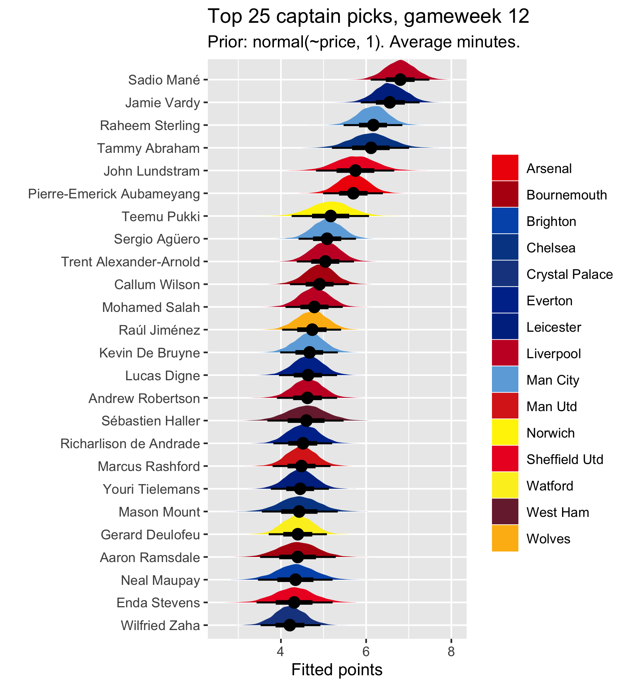
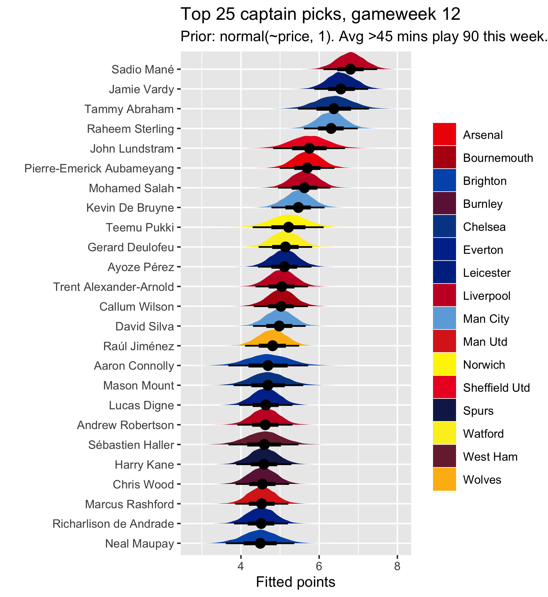
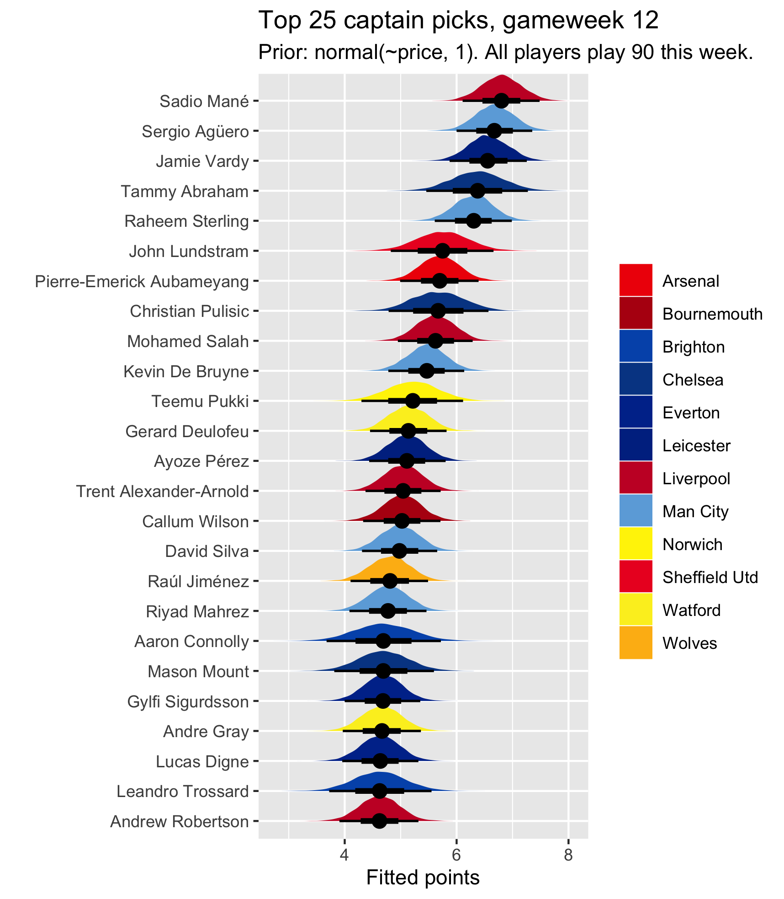

---
output:
  bookdown::html_document2: 
    toc: true
    toc_float: true
layout: post
title: Captaincy choice, FPL gameweek 12 2019
categories: blog
date: October 2019
---

## Picking an FPL captain: Gameweek 12 {-} 

Struggling to decide on a captain for gameweek 12? Thrown off by the fact that Liverpool and City are playing each other, making it difficult to pick the usual premium choices (Agüero/Mané/Sterling/Salah)? Each week I run a multilevel model which models the logic of captain selection by estimating the effect of players on points while accounting for their opponent, whether they are home or away, their form, and how many minutes they get, and factoring in that players are nested within teams. For more detail on the model, see [here](https://mbarnfield.github.io/2019-08-27-fpl-4.html) and [here](https://mbarnfield.github.io/2019-10-17-fpl-9.html). The TL;DR version is that I take and wrangle data from [vaastav's github](https://github.com/vaastav/Fantasy-Premier-League), fit the below model formula to this data, using [`brms`](https://github.com/paul-buerkner/brms) in `R`, and then get fitted draws from the posterior distribution for the upcoming gameweek's data (all the variables minus points, which are fitted):     

`points | weights(weight) ~ player + opponent + home + minutes + (1 | mm(team_1, team_2))`

The weights are based on gameweek, upweighting more recent performance, and the `mm(team_1, team_2)` part factors in that some players have played for more than one team over the course of the data (because I go back to gw 25 last season, and there was a transfer window in between). The rest seems pretty self-explanatory, but if not, see the links above.    

## Expectation vs reality - gameweek 11 {-}

The table below shows the model's top ten picks for gameweek 11 (in a version which assumes every player who has averaged over 45 minutes over the past five gameweeks gets 90 minutes in the upcoming gameweek). Half of the top ten got meaningful returns, which isn't too bad, and two of them (Mané and Abraham) got into the actual top ten for the gameweek. This is particularly good considering that you would have been very unlikely to entertain captaining any of the other real top ten, besides maybe Lundstram if you fancied a punt.    

| Top 10 in model | Points | Top 10 in reality | Points  |
| ----------------|--------|-------------------|-------- |
| Agüero          | 6      | Lundstram         | 21      |
| Sterling        | 1      | Soyüncü           | 14      |
| Mané            | 12     | Walker            | 14      |
| Vardy           | 6      | Mousset           | 13      |
| De Bruyne       | 2      | Smith (A)         | 12      |
| Abraham         | 12     | Montoya           | 12      |
| Salah           | 2      | Abraham           | 12      |
| Silva (D)       | 1      | Mané              | 12      |
| Aubameyang      | 8      | Trossard          | 11      |
| Mahrez          | 0      | Ramsdale          | 9       |

## Average minutes and 90 minutes {-}

A reminder that I report two versions of the model output. In the first, every player is assumed to play the same amount of minutes this week as their average minutes over the last five gameweeks. In the other (the one I prefer), every player with an average number of minutes over the last five greater than 45 (a half) is assumed to play 90 minutes (a whole game) this week. I'm open to suggestions on a better way to incorporate minutes into the output, but to me this seems fairly decent. I just can't really factor in Pep's wheel and other random variance in minutes. (There's actually a third output this week -- see below.)   

## Results {-}

The results for this gameweek are below. Things don't get as messed up by the City-Liverpool match as you might think. Mané is still seen as the overall most likely good captain choice. Sterling is up there, too. City and Liverpool players are definitely brought down slightly by their fixture difficulty in general, but this isn't strong enough to completely counter the consistency of Mané and high ceiling of Sterling. This is just capturing what most people are probably thinking anyway --- e.g. you probably back Mané to get a goal against City. Agüero is suffering considerably from his average minutes, which are below 45, meaning his points are based on playing less than one half in the first output, and he is factored out of the second output by design. I think this should have happened last week too, but I made a mistake in my code when calculating average minutes. This is also affecting players such as Pulisic, whose average minutes over the last five don't quite reach 45, because he has only just started getting decent minutes. Because of this and out of interest, I include a third output in which every single player is assumed to play 90 minutes this week (which is obviously impossible). Pulisic soars up to the top ten and Agüero takes his usual spot in the top three.     

The implication here is that you probably shouldn't worry too much about the Liverpool-City fixture. It seems likely that, should players such as Sterling, Mané and Agüero get decent minutes, they might get returns. At least, we are slightly more confident in them doing so than most other players.    

That being said, this confidence is minimal when it comes to comparing the premiums to on-fire players such as Vardy, Abraham and even Lundstram. When we assume 90 minutes, this is true of Pulisic too. Vardy, in particular, is establishing himself as a solid captain pick, based on this. He looks like a good shout if you are scared of captaining anyone in Liverpool-City, followed closely by Abraham.     

 

 

