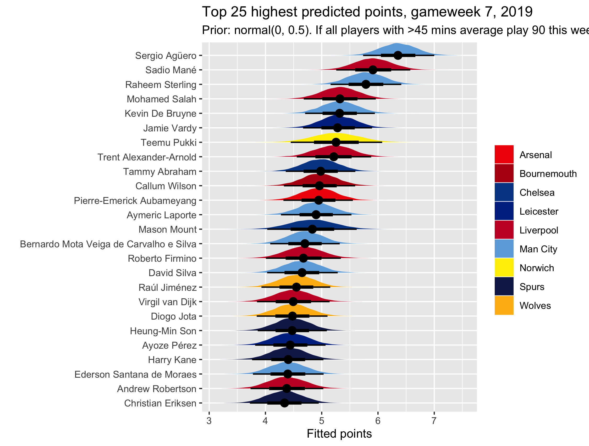
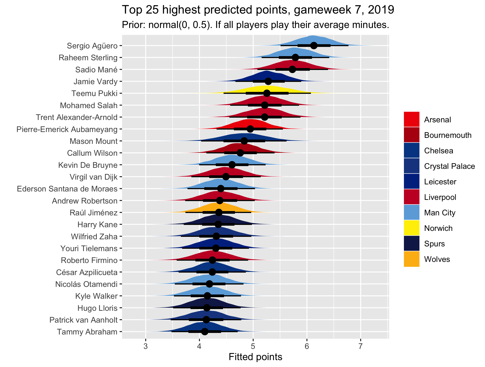

---
output:
  bookdown::html_document2: 
    toc: true
    toc_float: true
layout: post
title: Captaincy choice, FPL gameweek 7 2019
categories: blog
date: September 2019
---

## Picking an FPL captain: Gameweek 7 {-} 

I don't have much time to write this this week, so I'll get straight to the changes I have made and the results! Long story short, it looks like the standard top four are your best bets for captain this week: Agüero, Sterling, Mané and Salah. If you have him, you should captain Agüero, but the other three are good picks too.    

## Deciding how to determine player minutes {-}

Last week I discussed at length several changes I had made to the model. I make no such changes this week, with the model the same as it was then. The only differences now are in the way I predict the scores for the coming week. Last week, having introduced a minutes variable, I decided to assume players would play the same minutes they played the previous week and based their predictions on this. This led to some silly stuff though, such as De Bruyne not being in the top 25 because he was assumed to be playing 33 minutes. He went on to play and get a massive haul against Watford.    

This week, I have decided to base player minutes on an average over previous games. I take the previous five gameweeks and get a mean number of minutes for each player. I then go two different ways with this. I present one set of predictions where I assume the player will play this same number of minutes, and an alternative specification in which *all players whose average is over 45 minutes are assumed to play 90 minutes this week*. This is basically like asking the model how many points it would expect players who currently play regularly to get if they play 90 minutes this week. I don't think this is particularly problematic because it reflects our own intuitions about captaincy picks, which, again, is the whole point of the model.    

The only other change to the predictions is that I now follow a more typical Bayesian workflow that allows me to present player predictions as distributions. I use `tidybayes` to take 2000 posterior fitted draws for each player and then plot these as a probability distribution. The colours also no longer correspond to price, which isn't particularly useful, but to teams. I have tried to pick colours that accurately reflect the teams' colours. 

## Results {-}

The plots of results are below. Pay attention to figure titles and captions because these clarify which minutes specification is being used. As usual and understandably, Agüero is top. He just keeps scoring, plays for the highest-scoring team, and is playing against an opponent, in Everton, that really isn't firing on all cylinders. It's worth noting that Sheffield Utd are actually doing quite a good job of preventing players scoring many FPL points against them, meaning Salah and Mané are actually penalised more by their opponent than Agüero and Sterling are, even though Sheffield are a promoted side and Everton PL stalwarts.      

Looking at the 90 minutes plot, in which players who have on average played over a half (45 mins) over their last five gameweeks are all assumed to play the same 90 minutes, the top four are the same as every week recently. KDB is quickly turning this into a top five, though, and he's definitely a good pick too. I'd personally put more weight in this plot than the other one, which assumes all players play their average minutes, introducing variability in minutes. Interestingly, this puts Vardy and Pukki both ahead of Salah, because they get subbed off less often and less early. It also brings Aubameyang into the top 10 because he tends to play full 90 minutes every week. KDB drops out, meanwhile, because of that vicious Pep rotation wheel. 

 

Unless I transfer in Agüero this week, which I might, I'll be captaining Sterling - again. Surely he can't burn me two weeks in a row? In *both* predictions he is my top projected points scorer. (Again, depends whether I get Agüero.) Good luck all!

## Other posts {-}

<a href="2019-08-27-fpl-4.html">Gameweek 4 captaincy pick and introduction to model</a>    

<a href="2019-09-12-fpl-5.html">Gameweek 5 captaincy pick, discussion of priors</a>

<a href="2019-09-20-fpl-6.html">Gameweek 6 captaincy pick, discussion major model changes</a>